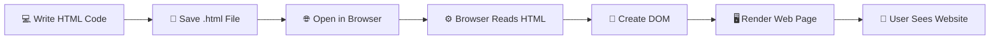
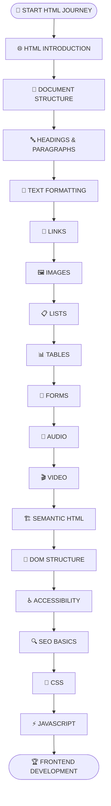
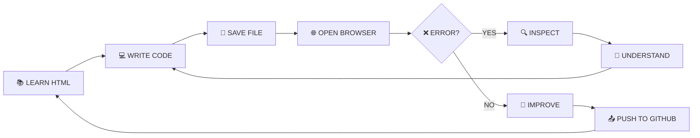

<!-- ========================================================= -->
<!--                  HTML PRACTICE README                     -->
<!--                    ROHIT PANDEY                            -->
<!-- ========================================================= -->

<div align="center">


</div>

<div align="center">


</div>

<br>

<div align="center">


</div>

<br>

```text
╔══════════════════════════════════════════════════════════════╗
║                                                              ║
║     ██╗  ██╗████████╗███╗   ███╗██╗     ███████╗            ║
║     ██║  ██║╚══██╔══╝████╗ ████║██║     ██╔════╝            ║
║     ███████║   ██║   ██╔████╔██║██║     ███████╗            ║
║     ██╔══██║   ██║   ██║╚██╔╝██║██║     ╚════██║            ║
║     ██║  ██║   ██║   ██║ ╚═╝ ██║███████╗███████║            ║
║     ╚═╝  ╚═╝   ╚═╝   ╚═╝     ╚═╝╚══════╝╚══════╝            ║
║                                                              ║
║                 WEB DEVELOPMENT SYSTEM                       ║
║                                                              ║
║           STRUCTURE  →  CREATE  →  RENDER  →  BUILD          ║
║                                                              ║
╚══════════════════════════════════════════════════════════════╝
```

---

# ⚡ WEB SYSTEM INITIALIZATION

```console
rohit@web-developer:~$ start html-practice

[ SYSTEM ] Starting Web Development Environment...

████████████████████████████████████████ 100%

[ OK ] HTML5 Engine Loaded
[ OK ] Browser Environment Connected
[ OK ] Web Page Structure Ready
[ OK ] HTML Elements Activated
[ OK ] Practice Repository Found
[ OK ] Developer Mode Enabled

TECHNOLOGY  : HTML5
CATEGORY    : FRONTEND DEVELOPMENT
ENVIRONMENT : WEB BROWSER
REPOSITORY  : HTML PRACTICE
STATUS      : ONLINE

MISSION     : LEARN → CREATE → RENDER → DEBUG → IMPROVE

rohit@web-developer:~$ _
```

---

<div align="center">

# 🌐 WELCOME TO MY HTML JOURNEY


</div>

Welcome to my **HTML Practice Repository**.

This repository is the digital record of my journey into the world of web development.

Here, I upload my daily:

- 🌐 HTML programs
- 🏗️ Web page structures
- 📝 Practice exercises
- 🧠 HTML concepts
- 🔗 Links and navigation examples
- 🖼️ Images and multimedia practice
- 📋 Forms and tables
- 🐞 Errors and solutions
- 🚀 Web development progress

Every HTML file represents another step toward my goal of becoming a **Java Full Stack Developer**.

```html
<!DOCTYPE html>

<html lang="en">

<head>

    <meta charset="UTF-8">

    <title>Developer Journey</title>

</head>

<body>

    <developer>

        <name>Rohit Pandey</name>

        <current-skill>HTML5</current-skill>

        <dream>Java Full Stack Developer</dream>

        <status>Learning Every Day 🚀</status>

    </developer>

</body>

</html>
```

---

# 🔥 WHAT IS HTML?

**HTML** stands for **HyperText Markup Language**.

HTML is the standard markup language used to create the structure and content of web pages.

It tells the web browser:

- What content should appear
- Where headings should be placed
- Where paragraphs should appear
- How images are displayed
- How links connect pages
- How tables organize data
- How forms collect information
- How audio and video are embedded

```text
┌──────────────────────────────────────────────────────────┐
│                                                          │
│                    🌐 WEBSITE                            │
│                                                          │
│                         │                                │
│                         ▼                                │
│                                                          │
│                 🏗️ HTML STRUCTURE                       │
│                                                          │
│                         +                                │
│                                                          │
│                   🎨 CSS DESIGN                          │
│                                                          │
│                         +                                │
│                                                          │
│                ⚡ JAVASCRIPT LOGIC                       │
│                                                          │
│                         │                                │
│                         ▼                                │
│                                                          │
│              🚀 MODERN WEB APPLICATION                   │
│                                                          │
└──────────────────────────────────────────────────────────┘
```

---

# 🧠 HOW HTML WORKS



---

# 🛰️ LIVE WEB DEVELOPER TERMINAL

```console
┌──(rohit㉿web-developer)-[~/HTML-Practice]
│
├── $ whoami
│
│   Rohit Pandey
│   B.Tech Computer Science Graduate
│   Aspiring Java Full Stack Developer
│
├── $ current_technology
│
│   HTML5 🌐
│
├── $ current_mission
│
│   HTML → CSS → JavaScript → Java Full Stack
│
├── $ repository_status
│
│   ● ACTIVE
│
├── $ developer_mode
│
│   LEARNING + CREATING + BUILDING
│
├── $ daily_progress
│
│   ████████████████████░░░░░░░░░░ LEARNING...
│
└── $ _
```

---

# 🗺️ COMPLETE HTML LEARNING ROADMAP



---

# 🌐 HTML ELEMENT COMMAND CENTER

<table>

<tr>

<td align="center" width="25%">

## 📄 STRUCTURE

```html
<html>
<head>
<body>
<header>
<main>
<footer>
```

</td>

<td align="center" width="25%">

## 🔤 TEXT

```html
<h1>
<p>
<b>
<strong>
<em>
<span>
```

</td>

<td align="center" width="25%">

## 🌐 MEDIA

```html

<audio>
<video>
<iframe>
<picture>
```

</td>

<td align="center" width="25%">

## 📝 FORMS

```html
<form>
<input>
<label>
<select>
<textarea>
<button>
```

</td>

</tr>

</table>

---

# 🧬 ANATOMY OF AN HTML DOCUMENT

```html
<!DOCTYPE html>

<html lang="en">

    <head>

        <meta charset="UTF-8">

        <meta
            name="viewport"
            content="width=device-width, initial-scale=1.0"
        >

        <title>My Website</title>

    </head>


    <body>

        <header>

            <h1>Welcome to My Website</h1>

        </header>


        <main>

            <section>

                <h2>About Me</h2>

                <p>
                    I am learning HTML5 and Web Development.
                </p>

            </section>

        </main>


        <footer>

            <p>Created by Rohit Pandey 🚀</p>

        </footer>

    </body>

</html>
```

---

# 🧩 HTML TAG UNIVERSE

```text
                              🌐 HTML
                                 │
           ┌─────────────────────┼─────────────────────┐
           │                     │                     │
           ▼                     ▼                     ▼
     📄 STRUCTURE            🔤 CONTENT            🌐 MEDIA
           │                     │                     │
           ▼                     ▼                     ▼
        <html>                  <h1>                 
        <head>                  <p>                  <audio>
        <body>                  <span>               <video>
           │                     │                     │
           └─────────────────────┼─────────────────────┘
                                 │
                                 ▼
                        🏗️ SEMANTIC HTML
                                 │
              ┌──────────────────┼──────────────────┐
              ▼                  ▼                  ▼
          <header>             <main>            <footer>
                                 │
                                 ▼
                          🚀 MODERN WEBSITE
```

---

# 📂 REPOSITORY ARCHITECTURE

```text
📦 HTML-Practice
│
├── 📄 Day01.html
│   │
│   ├── HTML Introduction
│   ├── Basic Structure
│   └── First Web Page
│
├── 📄 Day02.html
│   │
│   ├── Headings
│   ├── Paragraphs
│   └── Text Formatting
│
├── 📄 Day03.html
│   │
│   ├── Links
│   ├── Images
│   └── Practice Programs
│
├── 📄 Upcoming
│   │
│   ├── 🔒 Lists
│   ├── 🔒 Tables
│   ├── 🔒 Forms
│   ├── 🔒 Multimedia
│   └── 🔒 Semantic HTML
│
└── 📖 README.md
    │
    └── 👀 YOU ARE HERE
```

---

# 📚 HTML KNOWLEDGE MATRIX

| MODULE | CONCEPT | STATUS |
|:---:|:---|:---:|
| 01 | HTML Introduction | 🟢 COMPLETED |
| 02 | Document Structure | 🟢 COMPLETED |
| 03 | Headings & Paragraphs | 🟢 COMPLETED |
| 04 | Text Formatting | 🔵 PRACTICING |
| 05 | Links | 🔵 PRACTICING |
| 06 | Images | 🟡 LEARNING |
| 07 | Lists | ⚪ UPCOMING |
| 08 | Tables | ⚪ UPCOMING |
| 09 | Forms | ⚪ UPCOMING |
| 10 | Audio & Video | 🔒 LOCKED |
| 11 | Semantic HTML | 🔒 LOCKED |
| 12 | Accessibility | 🔒 LOCKED |
| 13 | SEO Basics | 🔒 LOCKED |
| 14 | CSS | 🔒 FUTURE MISSION |
| 15 | JavaScript | 🔒 FUTURE MISSION |

---

# 📊 WEB DEVELOPER SKILL SYSTEM

```text
╭────────────────────────────────────────────────────────────╮
│                                                            │
│   HTML FUNDAMENTALS                                        │
│   ████████████████████████████████████████  100%           │
│                                                            │
│   HTML STRUCTURE                                           │
│   ████████████████████████████████████░░░░   90%           │
│                                                            │
│   TEXT ELEMENTS                                            │
│   ████████████████████████████████░░░░░░░░   80%           │
│                                                            │
│   LINKS & IMAGES                                           │
│   ████████████████████████░░░░░░░░░░░░░░░░   60%           │
│                                                            │
│   TABLES & FORMS                                           │
│   ████████████░░░░░░░░░░░░░░░░░░░░░░░░░░░░   30%           │
│                                                            │
│   SEMANTIC HTML                                            │
│   ████░░░░░░░░░░░░░░░░░░░░░░░░░░░░░░░░░░░░   10%           │
│                                                            │
│   CSS                                                      │
│   ░░░░░░░░░░░░░░░░░░░░░░░░░░░░░░░░░░░░░░░░    0%           │
│                                                            │
│   JAVASCRIPT                                               │
│   ░░░░░░░░░░░░░░░░░░░░░░░░░░░░░░░░░░░░░░░░    0%           │
│                                                            │
╰────────────────────────────────────────────────────────────╯
```

---

# ⚙️ HOW MY WEB LEARNING SYSTEM WORKS



---

# 🔥 DYNAMIC HTML DEVELOPER EXPERIENCE

```html
<!DOCTYPE html>

<html lang="en">

<head>

    <meta charset="UTF-8">

    <title>Developer Journey</title>

</head>


<body>

    <main>

        <section id="developer">

            <h1>👋 Hi, I'm Rohit Pandey</h1>

            <h2>
                Aspiring Java Full Stack Developer
            </h2>

            <p>
                Current Skill: HTML5 🌐
            </p>

            <p>
                Current Mission:
                Learn → Practice → Build → Improve
            </p>

            <p>
                Status:
                Never Stop Learning 🚀
            </p>

        </section>

    </main>

</body>

</html>
```

---

# 🐞 WEB DEBUGGING SYSTEM

```console
WEB DEVELOPMENT SYSTEM STARTED...

> Loading HTML Document...

████████████████████████████████████ 100%

> Checking DOCTYPE.................... OK ✅

> Checking HTML Structure............. OK ✅

> Checking HEAD Element............... OK ✅

> Checking BODY Element............... OK ✅

> Checking Tags....................... ERROR ❌

> Starting Debug Mode................. ACTIVE 🔍

> Finding Missing Closing Tag......... FOUND ⚠️

> Fixing HTML Structure............... DONE ✅

> Reloading Browser................... SUCCESS ✅

> Rendering Web Page.................. SUCCESS 🚀


OUTPUT:

Every Error Makes Me a Better Web Developer 🔥
```

---

# 🧪 MY DAILY WEB DEVELOPMENT CYCLE

```text
                        ┌──────────────┐
                        │              │
                        │   📚 LEARN   │
                        │              │
                        └──────┬───────┘
                               │
                               ▼
                        ┌──────────────┐
                        │              │
                        │  💻 CREATE   │
                        │              │
                        └──────┬───────┘
                               │
                               ▼
                        ┌──────────────┐
                        │              │
                        │  🌐 RENDER   │
                        │              │
                        └──────┬───────┘
                               │
                               ▼
                        ┌──────────────┐
                        │              │
                        │   ❌ ERROR   │
                        │              │
                        └──────┬───────┘
                               │
                               ▼
                        ┌──────────────┐
                        │              │
                        │   🔍 DEBUG   │
                        │              │
                        └──────┬───────┘
                               │
                               ▼
                        ┌──────────────┐
                        │              │
                        │  🚀 IMPROVE  │
                        │              │
                        └──────┬───────┘
                               │
                               └────────────► REPEAT 🔁
```

---

# 🎯 CURRENT DEVELOPER MISSIONS

```text
[████████████████████] Learn HTML Fundamentals

[██████████████████░░] Master HTML Structure

[████████████████░░░░] Practice Text Elements

[██████████████░░░░░░] Master Links & Images

[██████████░░░░░░░░░░] Learn Tables

[████████░░░░░░░░░░░░] Master HTML Forms

[████░░░░░░░░░░░░░░░░] Learn Semantic HTML

[██░░░░░░░░░░░░░░░░░░] Learn CSS

[░░░░░░░░░░░░░░░░░░░░] Learn JavaScript

[░░░░░░░░░░░░░░░░░░░░] Become Java Full Stack Developer
```

---

# 🏆 WEB DEVELOPER ACHIEVEMENT SYSTEM

```text
╔══════════════════════════════════════════════════════════╗
║                                                          ║
║   🟢 WEB DEVELOPMENT JOURNEY STARTED                     ║
║                                                          ║
║   🟢 FIRST HTML PAGE CREATED                             ║
║                                                          ║
║   🟢 HTML STRUCTURE LEARNED                              ║
║                                                          ║
║   🔵 TEXT ELEMENTS IN PROGRESS                           ║
║                                                          ║
║   🟡 LINKS & IMAGES LOADING                              ║
║                                                          ║
║   🔒 HTML FORM DEVELOPER                                 ║
║                                                          ║
║   🔒 SEMANTIC HTML DEVELOPER                             ║
║                                                          ║
║   🔒 CSS DEVELOPER                                       ║
║                                                          ║
║   🔒 JAVASCRIPT DEVELOPER                                ║
║                                                          ║
║   🔒 JAVA FULL STACK DEVELOPER                           ║
║                                                          ║
╚══════════════════════════════════════════════════════════╝
```

---

# 👨‍💻 DEVELOPER PROFILE

<div align="center">


<br>

### 🎓 B.Tech Computer Science Graduate

### 🌐 Learning HTML5 & Web Development

### ☕ Learning Core Java

### 🗄️ Learning Oracle SQL & PL/SQL

### 💻 Practicing HTML • Java • SQL • Git • GitHub

### 🎯 Aspiring Java Full Stack Developer

### 🚀 Learning • Creating • Coding • Debugging • Improving

</div>

---

# 🧠 DEVELOPER PHILOSOPHY

```html
<developer>

    <name>Rohit Pandey</name>

    <hard-work>true</hard-work>

    <consistency>true</consistency>

    <giving-up>false</giving-up>

    <future>
        Java Full Stack Developer 🚀
    </future>

</developer>
```

---

<div align="center">

# ⚡ FINAL SYSTEM STATUS


<br><br>

### `<developer status="learning">Building The Future...</developer>`

<br>


</div>
